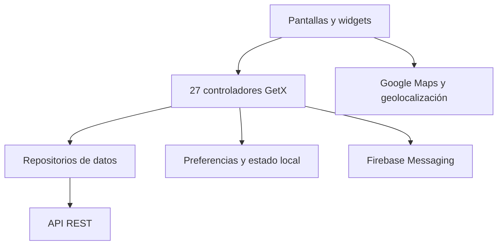

# SQ Customer — una sola app para compras, entregas y movilidad

SQ Customer reúne alimentos, comercio, farmacia, paquetería y transporte en una experiencia Flutter. El desafío técnico es mantener coherencia cuando cada vertical comparte identidad, ubicación, pagos y notificaciones, pero tiene recorridos y estados diferentes.

**Caso de portafolio:** Flutter desarrollado con apoyo de IA.

## En números

| Métrica | Valor |
| --- | ---: |
| Archivos Dart en `lib` | 517 |
| Pantallas | 68 |
| Controladores | 27 |
| Dominios funcionales | 33 |

## Qué puede hacer el usuario

- Explorar categorías, tiendas, productos, campañas y ofertas.
- Administrar carrito, cupones, favoritos y direcciones.
- Completar checkout con distintos métodos de pago.
- Seguir pedidos y recibir notificaciones.
- Conversar por chat y contactar soporte.
- Solicitar envíos de paquetería.
- Reservar transporte, elegir vehículo y consultar viajes.
- Gestionar perfil, wallet, referidos e historial.

## Arquitectura



La aplicación separa vistas, controladores, repositorios, modelos y utilidades. GetX coordina navegación, inyección y estado; los repositorios concentran comunicación remota; los modelos mantienen contratos entre API e interfaz.

## Dónde aportó la IA

La IA funcionó como copiloto para navegar una base de 517 archivos Dart:

- Proponer pruebas de widgets y escenarios de regresión.
- Localizar dependencias entre checkout, autenticación y configuración remota.
- Acelerar diagnóstico de compatibilidad en iOS.
- Generar alternativas de implementación que después se revisaron e integraron.
- Mantener cambios repetitivos consistentes entre módulos.

El criterio final —qué cambiar, cómo integrarlo y cómo validar el impacto— permaneció bajo control humano.

## Stack

Flutter, Dart, GetX, Firebase Messaging, Google Maps, geolocalización, notificaciones locales, HTTP, Shared Preferences y componentes HTML para contenido dinámico.

## Ejecución local

1. Usa Flutter con Dart `>=3.0.6 <4.0.0`.
2. Ejecuta `flutter pub get`.
3. Proporciona tus archivos Firebase locales:
   - `android/app/google-services.json`
   - `ios/GoogleService-Info.plist`
4. Sustituye `YOUR_GOOGLE_MAPS_API_KEY` en Android e iOS.
5. Inicia la aplicación:

```bash
flutter run --dart-define=API_BASE_URL=https://api.example.com
```

## Temas para entrevista

- Manejo de estado en una app con múltiples verticales.
- Reutilización sin acoplar flujos de compra, paquetería y transporte.
- Checkout, ubicación y autenticación como dependencias transversales.
- Uso responsable de IA en una base móvil extensa.

La copia utiliza nombres neutrales y configuración ficticia. No contiene credenciales, datos de producción ni llaves de firma.

