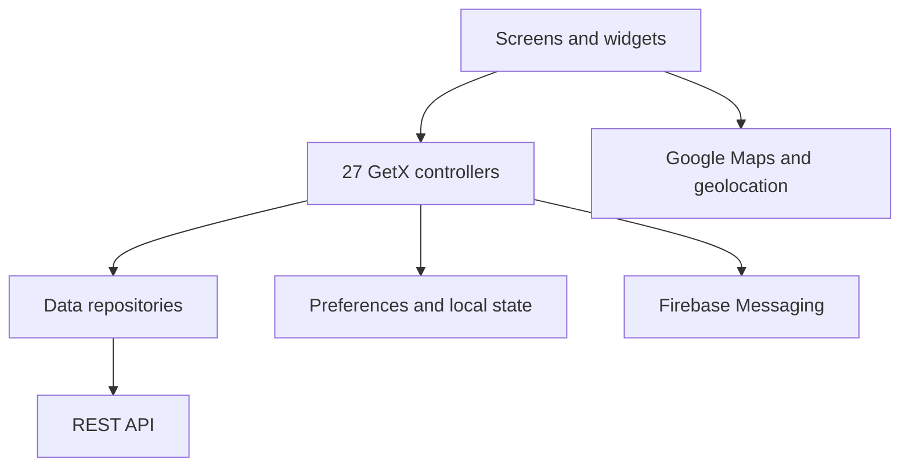

# SQ Customer — One Flutter App for Commerce, Delivery, and Mobility

SQ Customer brings food, retail, pharmacy, parcel delivery, and transportation into one Flutter experience. The technical challenge is preserving consistency when every vertical shares identity, location, payments, and notifications while following a different journey and state model.

**Development approach:** Built in Flutter with AI assistance.

## At a glance

| Metric | Value |
| --- | ---: |
| Dart files in `lib` | 517 |
| Screens | 68 |
| Controllers | 27 |
| Functional domains | 33 |

## What customers can do

- Browse categories, stores, products, campaigns, and promotions.
- Manage a cart, coupons, favorites, and addresses.
- Complete checkout with multiple payment methods.
- Track orders and receive notifications.
- Chat with support.
- Request parcel delivery.
- Book transportation, select a vehicle, and review trips.
- Manage a profile, wallet, referrals, and history.

## Relevance to client engagement

These workflows transfer directly to a customer-facing field service app:

- Request or book a service from a phone.
- Provide a location, address, and service instructions.
- Check job status and receive notifications.
- Communicate with support or operations.
- Pay and review service history in one place.

The customer experience depends on location, work, communication, and payment sharing the same context. SQ Customer demonstrates how to coordinate those dependencies in a large mobile application.

## Architecture



The application separates views, controllers, repositories, models, and utilities. GetX coordinates navigation, dependency injection, and state. Repositories centralize remote communication, while models preserve contracts between the API and UI.

## Where AI helped

AI acted as a copilot for navigating a codebase with 517 Dart files:

- Proposing widget tests and regression scenarios.
- Tracing dependencies across checkout, authentication, and remote configuration.
- Accelerating the diagnosis of iOS compatibility issues.
- Generating implementation alternatives that were reviewed before integration.
- Keeping repetitive changes consistent across modules.

Human judgment remained responsible for what to change, how to integrate it, and how to validate the impact.

## Stack

Flutter, Dart, GetX, Firebase Messaging, Google Maps, geolocation, local notifications, HTTP, Shared Preferences, and HTML components for dynamic content.

## Local setup

1. Use Flutter with Dart `>=3.0.6 <4.0.0`.
2. Run `flutter pub get`.
3. Provide local Firebase configuration files:
   - `android/app/google-services.json`
   - `ios/GoogleService-Info.plist`
4. Replace `YOUR_GOOGLE_MAPS_API_KEY` in Android and iOS.
5. Start the application:

```bash
flutter run --dart-define=API_BASE_URL=https://api.example.com
```

## Interview discussion points

- State management across multiple business verticals.
- Reuse without coupling commerce, parcel, and transportation flows.
- Checkout, location, and authentication as cross-cutting dependencies.
- Responsible use of AI in a large mobile codebase.

The repository uses neutral names and placeholder configuration. It contains no credentials, production data, or signing keys.
